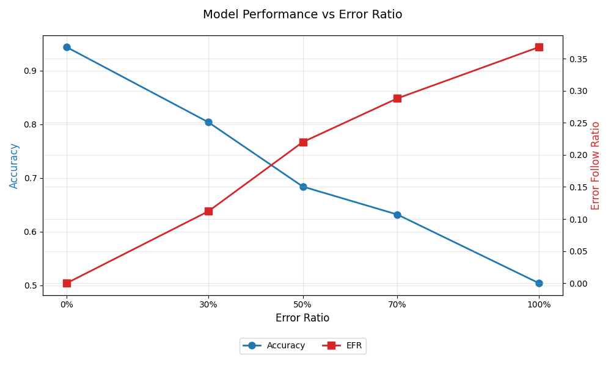

# In-Context Learning: 引入错误示例时的模型表现

本实验旨在研究大模型（DeepSeek-V3）在 prompt 中包含错误示例时，其回答准确性所受到的影响，希望揭示当示例与事实冲突时，模型如何平衡先验知识与上下文信息。

- 数据准备：从 https://people.eecs.berkeley.edu/~hendrycks/data.tar 获取数据集，使用 test_v3.py 中的 load_mmlu 函数加载 test\high_school_mathematics_test.csv 数据，该数据集内容为高中数学水平的单项选择题。
- 数据处理：利用 format_mmlu 函数将数据格式化为特定的提示和答案格式，通过 corrupt_mmlu 和 batch_corrupt 函数向数据中注入不同比例的错误示例。本实验中注入错误的方式为：在题目描述后提供一个参考答案，该答案的置信度对模型不可见。
- 模型查询：使用 safe_query 函数调用 DeepSeek-V3 模型进行查询，每次查询要求模型只输出答案标签，记录模型的回答。
- 结果记录与分析：将每次查询的详细信息记录在 results 文件夹下的 detail_log_*.csv 文件中，最终的实验结果（包括准确率、错误跟随率等）汇总到 final_result.csv 文件中。
- 结果可视化：使用 plot.py 脚本读取 final_result.csv 文件，绘制模型性能（准确率和错误跟随率）随错误比率变化的图表。

实验结果表明，当 prompt 中包含错误示例时，模型的输出准确性会显著降低，且错误示例越多，准确率越低；当 prompt 中展示了错误的答案标签时，模型有答案模仿倾向，这表明该模型没有具备足够的逻辑抗干扰能力.